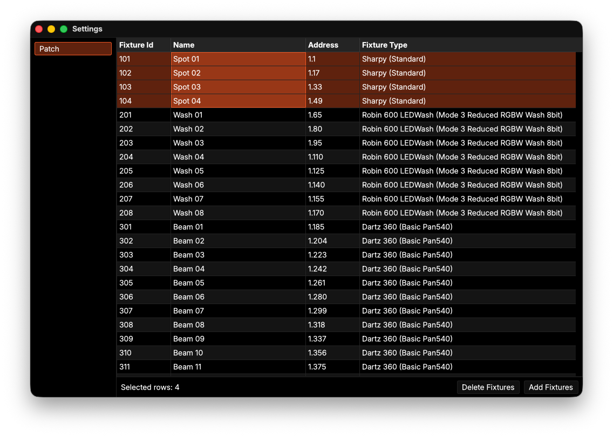
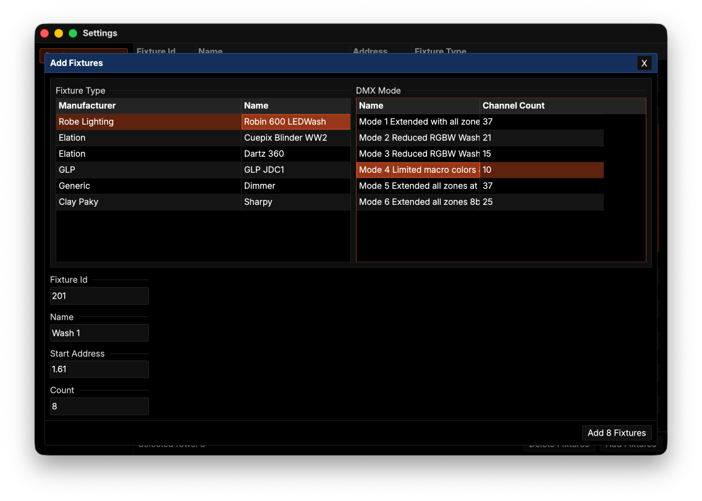

# Radiant

_An experimental, node-graph based lighting control system written in Rust and [GPUI](https://www.gpui.rs)._

Radiant's primary mechanism for generating effects are node-graphs. A node-graph can be run on a fixture group, processing the graph (with some context) for each fixture in that group. In more recent versions of Radiant, the node system has been removed, because I want to make sure the fundemental structure of the software (think attribute processing, patches, etc.) is in place before working on actually generating dynamic effects.

### ⚠️ **DISCLAIMER** ⚠️

This project is in an **experimental** and **very early** stage of development. In it's current state, Radiant is almost unusable for the average user. It does not remotely have a defined feature set and is subject breaking changes without any notice.

With GPUI, the UI framework used for Radiant, still being linked to the [Zed Editor](https://zed.dev) it's poorly documented and breaking changes in the API occur often, resulting in possible changes in behaviour. Still, I've chosen GPUI as the UI framework for Radiant to learn about GPUI and to test it in a codebase other than Zed's. Also it's a really cool framework, do try it out!

## Try it out!

For the time being, the only way to try out Radiant is by building it from source.
You can use `cargo run --release -- examples/showfile` in the project root to build and run.

With exception for some settings, most of the configuraton of a showfile can only be done by manually editing the showfile itself. This is because I want to make sure the functionality is correct before implementing the UI.

In the showfile you can configure your patch using the shortcut `cmd-,` (place your GDTF files you want to reference in `<showfile-path>/gdtf_files`).

